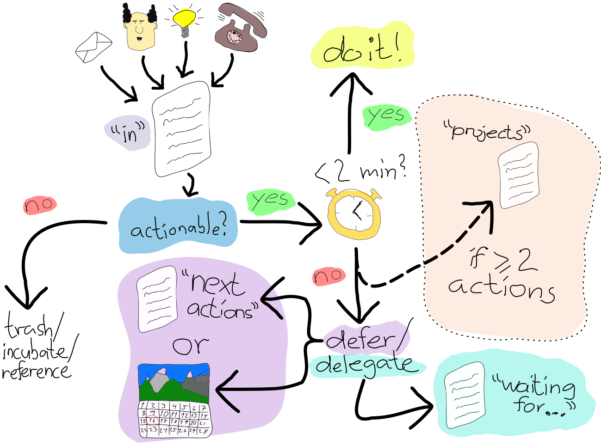

# fruition

> getting-things-done-as-a-~~~service~~~-react-app

GTD—or “Getting things done”—is a framework for organizing and tracking your tasks and projects. Its aim is a bit higher than just “getting things done”, though. (It should have been called “Getting things done in a much better way than just letting things happen, which often turns out not to be very cool at all”.) Its aim is to make you have 100% trust in a system for collecting tasks, ideas, and projects—both vague things like “invent greatest thing ever” and concrete things like “call Ada 25 August to discuss cheesecake recipe”. Everything!

A typical GTD worklow will look like this:

To read more about GTD, look [here](https://hamberg.no/gtd/).
